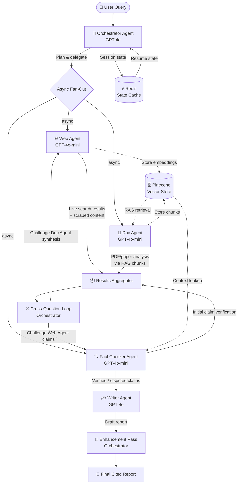
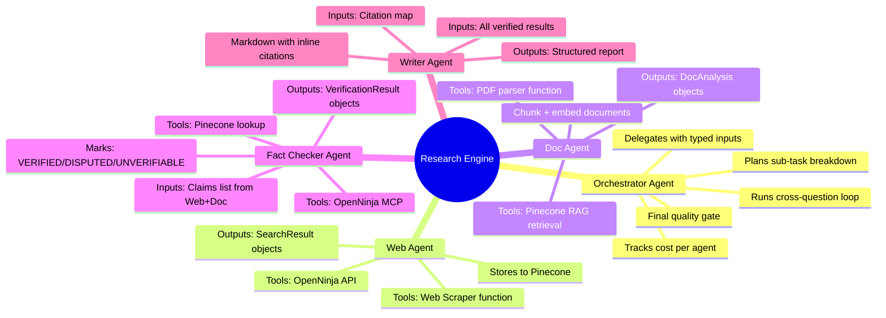
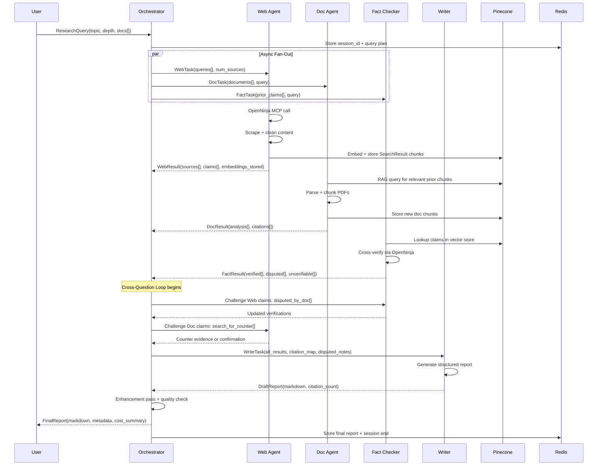
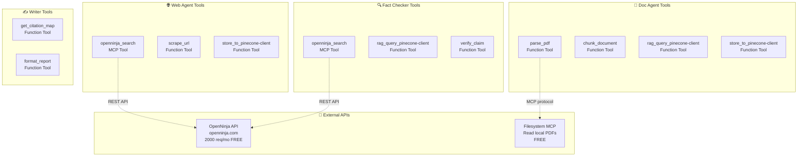
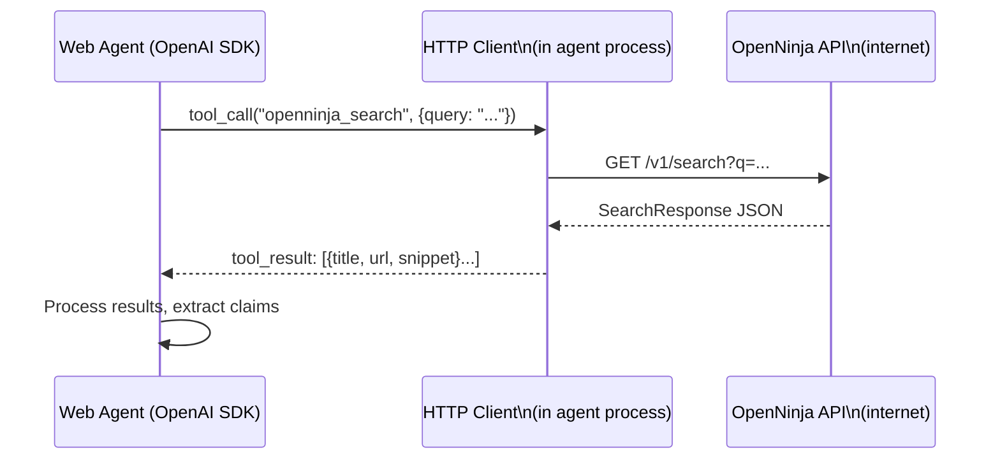
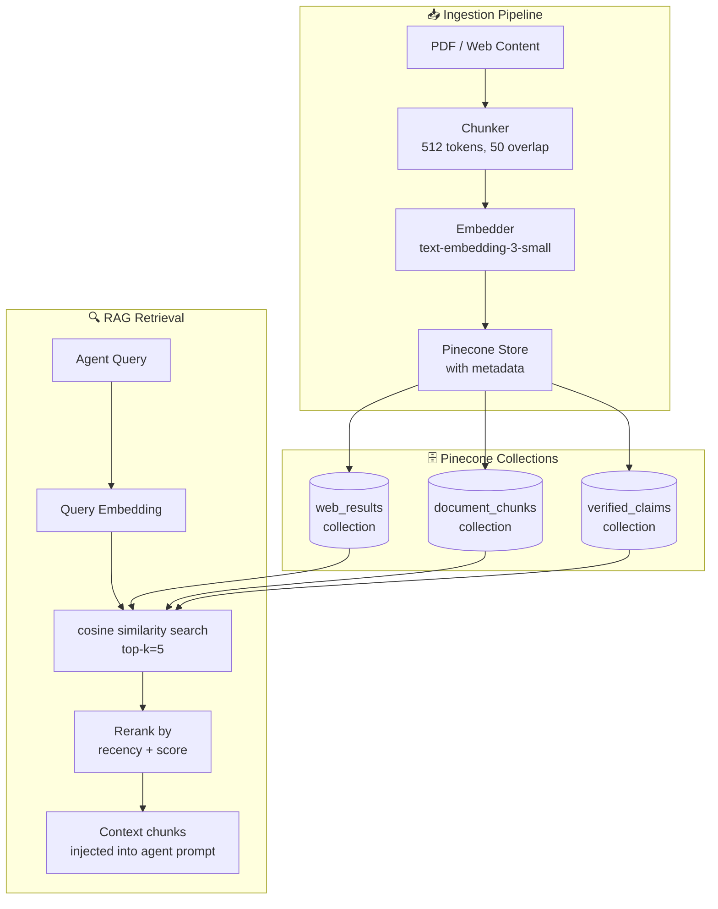

# 📋 PRD: Multi-Agent Research Content Engine
### *An S-Tier AI Engineering Portfolio Project*

---

> **Version:** 1.0 — Phase 1 (Core Engine)  
> **Stack:** OpenAI Agents SDK · Pinecone (free RAG) · OpenNinja API (free tier) · asyncio · Redis (local)  
> **Goal:** Build a production-grade multi-agent orchestration system that researches, cross-verifies, and generates cited research reports — then tears its own work apart and makes it better.

---

## 1. Executive Summary

The **Multi-Agent Research Content Engine** is an AI system where an **Orchestrator Agent** (the brain) delegates work to four specialized **Sub-Agents** (the workers). After gathering all their individual outputs, the system does something most demos skip — it **cross-questions its own findings**: the Fact Checker agent challenges the Web Agent's claims, the Doc Agent challenges the Writer's synthesis, and the Orchestrator runs a final rectification pass. The result is a cited, cross-verified research report.

This project is designed to teach you:
- How **real multi-agent orchestration** works (not just prompt chaining)
- The tradeoffs between **async fan-out vs. sequential pipelines**
- How **RAG + vector memory** gives agents long-term context
- What **MCP (Model Context Protocol)** is and why it matters
- How **tool calling** works at the agent level
- Where things **break** in production and how to design for resilience

---

## 2. Problem Statement

Single LLM calls produce hallucinated, uncited, shallow research. The internet has too much information for one call to synthesize well. Production AI systems need:

1. **Specialization** — different agents are better at different tasks
2. **Parallelism** — fan-out across sub-agents cuts latency by 3–4x
3. **Adversarial cross-checking** — agents must challenge each other's work
4. **Memory** — agents share a vector store so they don't re-fetch the same facts
5. **Traceability** — every claim must have a source, every source must be stored

This PRD defines a system that solves all five.

---

## 3. Goals & Non-Goals

### ✅ Phase 1 Goals (This PRD)
- Working Orchestrator → Sub-Agent delegation via OpenAI Agents SDK
- Four specialized agents: Web, Doc, Fact Checker, Writer
- Async parallel execution of Web + Doc + Fact agents
- Pinecone as free local vector store (RAG memory)
- OpenNinja API as free web search tool
- Cross-questioning loop: agents challenge each other's outputs
- Final cited report generation
- CLI interface to run a research query end-to-end
- Cost tracking per agent run (token usage logging)

### ❌ Phase 1 Non-Goals
- Guardrails & content moderation (Phase 2)
- UI / Frontend
- Cloud deployment
- PDF upload via UI
- Authentication / multi-tenancy

---

## 4. Tech Stack Decisions & Tradeoffs

| Component | Chosen Tool | Free? | Why | Alternative |
|---|---|---|---|---|
| Agent Framework | **OpenAI Agents SDK** | API costs only | Native tool calling, handoffs, tracing | LangGraph, CrewAI |
| LLM | **GPT-4o-mini** (workers) + **GPT-4o** (orchestrator) | Pay-per-token | Cost-efficient fan-out | GPT-4-turbo |
| Vector DB / RAG | **Pinecone** (local) | ✅ Free | No infra, persistent local store | Qdrant, Weaviate |
| Web Search | **OpenNinja API** (2,000 req/mo free) | ✅ Free tier | Real-time web and SERP data | Tavily, SerpAPI |
| Async Tasks | **Python asyncio** | ✅ Free | Native, no Celery overhead for Phase 1 | Celery + Redis |
| State / Cache | **Redis** (local Docker) | ✅ Free | Agent state between turns | In-memory dict |
| Embeddings | **OpenAI text-embedding-3-small** | ~$0.001/1M tokens | Best quality/cost | sentence-transformers |
| Document Parsing | **PyMuPDF + Unstructured** | ✅ Free | PDF/DOCX chunking for RAG | LlamaParse |
| Tracing | **OpenAI Agents built-in tracing** | ✅ Free | Zero-config span traces | LangSmith |

### Key Tradeoff Decisions

**Why Pinecone over Pinecone?**
Pinecone provides a fully managed, serverless vector database that natively integrates with cloud deployments. It removes the need for local data management, which is more representative of modern cloud-native AI architectures while offering a generous Serverless free tier.

**Why asyncio over Celery?**
Celery adds a broker (Redis/RabbitMQ), workers, and serialization overhead. For Phase 1, Python's `asyncio.gather()` gives you parallel fan-out with zero infrastructure. You'll learn the same concurrency concepts. Celery becomes meaningful in Phase 2 when you want distributed workers across machines.

**Why OpenAI Agents SDK over LangChain?**
OpenAI's SDK has native support for tool calling, agent handoffs, and built-in tracing. LangChain adds abstraction layers that obscure what's actually happening — bad for a learning project. The SDK forces you to understand the raw mechanics: tool schemas, function calling JSON, agent loops.

---

## 5. System Architecture

### 5.1 High-Level Flow



---

### 5.2 Agent Roles Deep Dive



---

### 5.3 Data Flow & Message Schema



---

### 5.4 Cross-Question Loop Detail

This is the most important architectural insight — most multi-agent demos skip this entirely.

```mermaid
flowchart LR
    subgraph RESULTS["📦 Initial Results"]
        WR_OUT[Web Agent Output\n'X causes Y'\nSource: Site A]
        DR_OUT[Doc Agent Output\n'X does NOT cause Y'\nPaper: 2023 Study]
        FR_OUT[Fact Checker\n'Y partially confirmed\nby 2 sources']
    end

    subgraph CQ["⚔️ Cross-Question Engine"]
        CONFLICT[Conflict Detection\nWeb vs Doc contradiction]
        CHALLENGE1[Challenge → Fact Checker\n'Verify X causes Y vs paper']
        CHALLENGE2[Challenge → Web Agent\n'Find more evidence for 2023 paper']
        MERGE[Merge & Weight\nby source count + recency]
    end

    subgraph RESOLUTION["✅ Resolution"]
        VERDICT[Claim Verdict\nVERIFIED / DISPUTED / NUANCED]
        NOTE[Dispute Note\n'Sources conflict. Web claims X,\npeer-reviewed paper claims NOT X']
    end

    RESULTS --> CQ
    CQ --> RESOLUTION
    RESOLUTION --> WRITER_INPUT[Writer Agent\ngiven verdicts + dispute notes]
```



---

### 5.5 Tool Architecture (What Each Agent Can Call)



---

## 6. Directory Structure

```
multi-agent-research-engine/
│
├── agents/
│   ├── orchestrator.py       # Main orchestrator agent + cross-question loop
│   ├── web_agent.py          # Web research agent
│   ├── doc_agent.py          # Document analysis agent  
│   ├── fact_checker.py       # Fact verification agent
│   └── writer.py             # Report generation agent
│
├── tools/
│   ├── openninja_search.py       # OpenNinja MCP wrapper
│   ├── web_scraper.py        # URL scraping tool
│   ├── pinecone-client_tools.py     # RAG store + retrieval tools
│   ├── pdf_parser.py         # PyMuPDF document parser
│   └── cost_tracker.py       # Token usage per agent
│
├── memory/
│   ├── vector_store.py       # Pinecone client + collections
│   └── session_state.py      # Redis state management
│
├── schemas/
│   ├── inputs.py             # Pydantic: ResearchQuery, WebTask, DocTask...
│   └── outputs.py            # Pydantic: WebResult, DocResult, FinalReport...
│
├── api/
│   └── openninja_api_config.json # API configuration
│
├── engine.py                 # Main entry point — runs the full pipeline
├── config.py                 # API keys, model names, settings
├── requirements.txt
├── docker-compose.yml        # Redis local setup
└── README.md
```

---

## 7. Pydantic Schemas (Contract Between Agents)

Agents don't pass raw text to each other. They pass **typed objects**. This is critical for production systems — it forces you to think about contracts between services.

```python
# schemas/inputs.py
class ResearchQuery(BaseModel):
    topic: str
    depth: Literal["shallow", "medium", "deep"] = "medium"
    documents: list[str] = []          # local PDF paths
    max_sources: int = 10
    session_id: str = Field(default_factory=lambda: str(uuid4()))

class WebTask(BaseModel):
    queries: list[str]                  # 3-5 search queries
    num_sources_per_query: int = 3
    session_id: str

class DocTask(BaseModel):
    documents: list[str]               # file paths
    query: str
    session_id: str

class FactTask(BaseModel):
    claims: list[str]                  # extracted claims to verify
    query_context: str
    session_id: str

# schemas/outputs.py
class Source(BaseModel):
    url: str
    title: str
    snippet: str
    retrieved_at: datetime
    embedding_id: str                  # Pinecone doc ID

class ClaimVerification(BaseModel):
    claim: str
    verdict: Literal["VERIFIED", "DISPUTED", "UNVERIFIABLE", "NUANCED"]
    supporting_sources: list[Source]
    dispute_note: str | None = None

class FinalReport(BaseModel):
    topic: str
    session_id: str
    markdown: str
    total_sources: int
    verified_claims: int
    disputed_claims: int
    cost_usd: float
    agent_costs: dict[str, float]      # per-agent token cost breakdown
    generated_at: datetime
```

---

## 8. The Cross-Question Algorithm

```python
# orchestrator.py — simplified pseudocode
async def cross_question_loop(
    web_result: WebResult,
    doc_result: DocResult,
    fact_result: FactResult
) -> list[ClaimVerification]:
    
    # Step 1: Find conflicts between Web and Doc agents
    conflicts = detect_conflicts(web_result.claims, doc_result.claims)
    
    # Step 2: Send conflicts back to Fact Checker for deeper verification
    if conflicts:
        deep_fact_task = FactTask(
            claims=[c.claim for c in conflicts],
            query_context="Cross-verify conflicting claims"
        )
        updated_facts = await fact_checker_agent.run(deep_fact_task)
    
    # Step 3: If Fact Checker finds Doc Agent is right, challenge Web Agent
    web_challenges = [f for f in updated_facts if f.verdict == "DISPUTED" 
                      and f.disputed_source == "web"]
    if web_challenges:
        counter_web = await web_agent.run(
            WebTask(queries=[f"counter evidence: {c.claim}" 
                            for c in web_challenges])
        )
    
    # Step 4: Merge all into final verdicts with weights
    return merge_verdicts(
        original_facts=fact_result.verifications,
        updated_facts=updated_facts,
        web_weight=0.4,    # recency bias
        doc_weight=0.6     # peer-review bias
    )
```

---

## 9. API Integration: How It Actually Works

While MCP provides a standard protocol, we will use the **OpenNinja REST API** directly for flexibility.



**Why this matters architecturally:** Decoupling tool *capability* from tool *implementation* allows us to swap search providers easily. Whether using MCP or a direct REST API, the agent logic remains focused on processing the results.

---

## 10. RAG Memory Architecture



**Metadata stored per chunk:**
```python
{
    "source_url": "https://...",
    "agent": "web_agent",
    "session_id": "abc-123",
    "chunk_index": 2,
    "retrieved_at": "2024-01-15T10:30:00Z",
    "topic": "climate change",
    "claim_verified": True   # updated by Fact Checker
}
```

---

## 11. Phased Development Plan

### Phase 1, Sprint 1: Foundation (Week 1–2)
- [ ] Set up OpenAI Agents SDK project structure
- [ ] Implement Pydantic schemas for all inputs/outputs
- [ ] Build Pinecone vector store wrapper (`memory/vector_store.py`)
- [ ] Integrate OpenNinja MCP server (local subprocess)
- [ ] Write Web Agent with Brave search + Pinecone store tools
- [ ] Basic CLI: single agent, single query, single output

### Phase 1, Sprint 2: Multi-Agent (Week 3–4)
- [ ] Build Doc Agent with PDF parsing + RAG retrieval
- [ ] Build Fact Checker Agent with claim verification logic
- [ ] Build Writer Agent with citation map generation
- [ ] Implement Orchestrator with async fan-out (`asyncio.gather`)
- [ ] Redis session state management
- [ ] Cost tracking per agent (log token usage)

### Phase 1, Sprint 3: Cross-Question Loop (Week 5–6)
- [ ] Implement conflict detection between Web vs Doc outputs
- [ ] Build cross-question loop in Orchestrator
- [ ] Test with known contradictory topics (e.g. coffee health claims)
- [ ] Implement dispute notes in final report
- [ ] End-to-end integration test: query → final report
- [ ] README + demo recording

### Phase 2 (Future): Guardrails & Production
- [ ] Input validation guardrails (prompt injection detection)
- [ ] Output guardrails (hallucination scoring, citation validation)
- [ ] Rate limit handling + retry logic
- [ ] Celery for distributed async workers
- [ ] FastAPI wrapper for REST API
- [ ] Streamlit UI
- [ ] Docker Compose full stack

---

## 12. Key Learning Outcomes Per Component

| What You Build | What You Learn |
|---|---|
| Orchestrator + Handoffs | How agents delegate and collect typed results; what "agent loop" means |
| Async Fan-Out | `asyncio.gather`, race conditions, timeout handling |
| Tool Calling | OpenAI function calling JSON schema, how tools are selected |
| MCP Integration | JSON-RPC protocol, subprocess MCP servers, tool discovery |
| Pinecone RAG | Embedding models, cosine similarity, chunk sizing tradeoffs |
| Cross-Question Loop | Adversarial agent design, conflict resolution, weighted verdicts |
| Pydantic Schemas | Contract-first design between services — essential for real systems |
| Cost Tracking | Token counting, cost estimation — critical for production |
| Redis State | Stateful vs stateless agents, session management |

---

## 13. Tradeoffs to Document in Your Portfolio

These are the questions interviewers will ask. Your PRD should show you thought about them upfront:

**1. Why async fan-out vs. sequential?**  
Sequential: simpler, easier to debug, each agent can use prior results. Fan-out: 3–4x faster, but agents can't see each other's live output. We chose fan-out for Phase 1 and use the cross-question loop as a second pass for inter-agent awareness.

**2. Why Pinecone's cosine similarity vs. dot product?**  
Cosine similarity normalizes for vector magnitude — better for comparing text chunks of different lengths. Dot product is faster but favors longer vectors. For research text where chunks vary in size, cosine is the right default.

**3. Why GPT-4o for Orchestrator vs. GPT-4o-mini for workers?**  
The Orchestrator does complex reasoning: planning, conflict detection, quality judgment. Workers do narrower tasks: search, chunk, verify. Using mini for workers cuts cost by ~10x per task with minimal quality drop on structured tasks.

**4. What breaks at scale?**  
Pinecone is single-node and not horizontally scalable → migrate to Qdrant/Weaviate for production. asyncio is single-process → migrate to Celery for distributed. Redis session state needs TTL and eviction policies for multi-user scenarios.

---

## 14. Success Metrics

| Metric | Target |
|---|---|
| End-to-end query → report time | < 45 seconds for medium depth |
| Citation coverage | ≥ 80% of claims have ≥ 1 source |
| Cross-question conflict detection rate | Flags contradictions in test cases |
| Cost per report (medium depth) | < $0.15 using gpt-4o-mini workers |
| Fact Checker VERIFIED rate on known facts | ≥ 85% accuracy |
| Pinecone retrieval relevance | Top-5 chunks relevant in manual eval |

---

## 15. Environment Setup (Quick Reference)

```bash
# 1. Install dependencies
pip install openai-agents pinecone-client PyMuPDF unstructured redis pydantic

# 2. Start Redis locally
docker run -d -p 6379:6379 redis:alpine

# 3. Install Brave MCP server
npx @modelcontextprotocol/server-openninja-search
# Get free API key: https://api.search.openninja.com/register (2000 req/mo)

# 4. Set environment variables
export OPENAI_API_KEY=sk-...
export OPENNINJA_API_KEY=NINJA...

# 5. Run the engine
python engine.py --query "What are the health effects of intermittent fasting?" --depth medium
```

---

*Phase 2 PRD (Guardrails) will cover: input sanitization, output validation, hallucination scoring, Llama Guard integration, rate limiting, and human-in-the-loop approval flows for disputed claims.*
